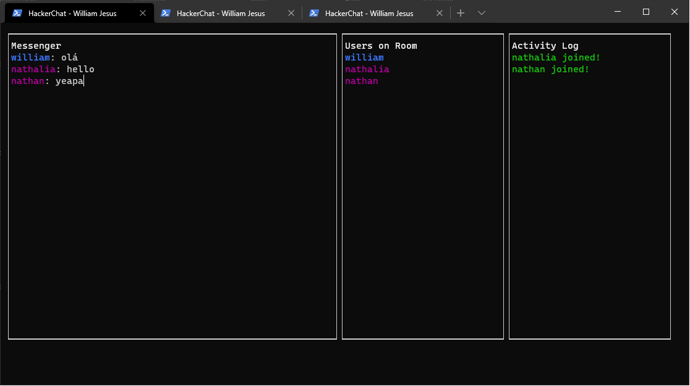

# Hacker Chat
Projeto desenvolvido durante a semana Javascript Expert 03 do Erick Wendel. O projeto visa a criação de um chat via linha de comando, usando um servidor web.

O código fonte completo de cada aula está dividido nas seguintes pastas:

- [Aula 01](./hacker-chat-aula01)
- [Aula 02](./hacker-chat-aula02)
- [Aula 03](./hacker-chat-aula03)
- [Aula 04](./hacker-chat-aula04)

### ***Bibliotecas utilizadas***
------------
+ **client**
  + [BLESSED](https://www.npmjs.com/package/blessed) - Uma biblioteca com uma API de interface de terminal de alto nível para node.js.
+ **server**
  + [UUID](https://www.npmjs.com/package/uuid) - Para a criação de UUIDs RFC4122

### ***Links do projeto***
------------
+ **client**
  + [NPM](https://www.npmjs.com/package/@williamjesusdev/hacker-chat) - @williamjesusdev/hacker-chat
+ **server**
  + [HEROKU](https://w-hacker-chat.herokuapp.com) - w-hacker-chat

### ***Preview***
------------
